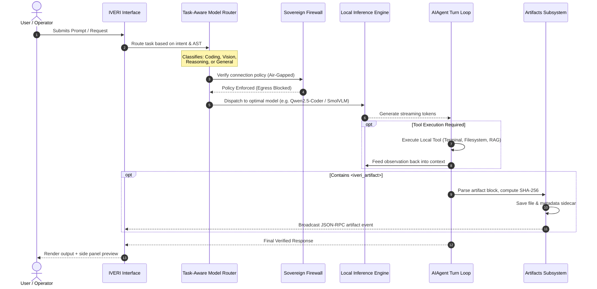
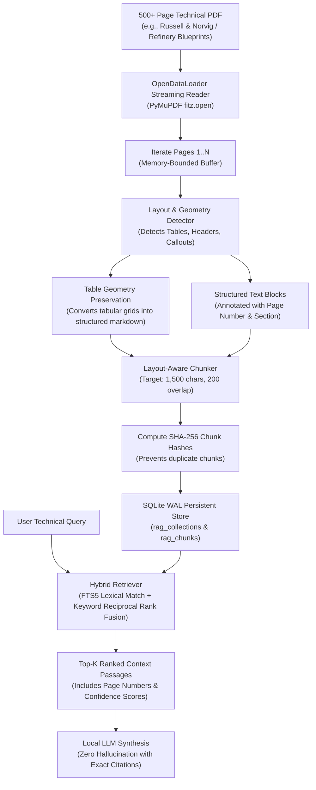
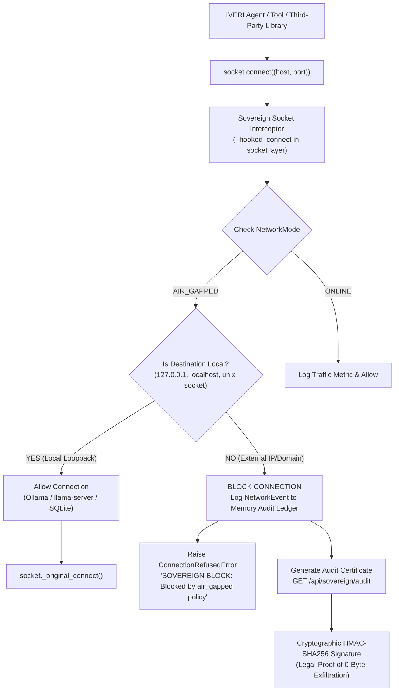
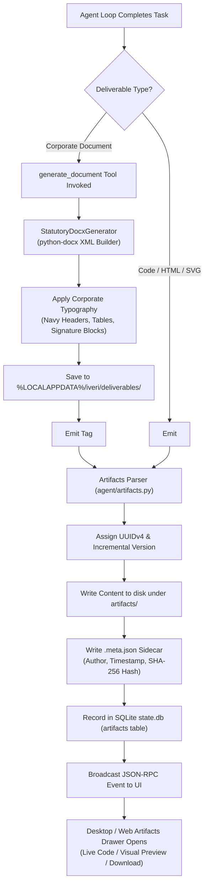

# IVERI AI Agent — Master Architecture, Flowcharts, Tech Stack & Grand Feature Matrix

```
  ██╗██╗   ██╗███████╗██████╗ ██╗       █████╗ ██╗       █████╗  ██████╗ ███████╗███╗   ██╗████████╗
  ██║██║   ██║██╔════╝██╔══██╗██║      ██╔══██╗██║      ██╔══██╗██╔════╝ ██╔════╝████╗  ██║╚══██╔══╝
  ██║██║   ██║█████╗  ██████╔╝██║█████╗███████║██║█████╗███████║██║  ███╗█████╗  ██╔██╗ ██║   ██║   
  ██║╚██╗ ██╔╝██╔══╝  ██╔══██╗██║╚════╝██╔══██║██║╚════╝██╔══██║██║   ██║██╔══╝  ██║╚██╗██║   ██║   
  ██║ ╚████╔╝ ███████╗██║  ██║██║      ██║  ██║██║      ██║  ██║╚██████╔╝███████╗██║ ╚████║   ██║   
  ╚═╝  ╚═══╝  ╚══════╝╚═╝  ╚═╝╚═╝      ╚═╝  ╚═╝╚═╝      ╚═╝  ╚═╝ ╚═════╝ ╚══════╝╚═╝  ╚═══╝   ╚═╝   
```

**Project Owners & Authors**:  
- **Ishwari Bhoyar** ([@ishwaribhoyar](https://github.com/ishwaribhoyar)) — `ishwaribhoyar2@gmail.com`  
- **Nishant Bhoyar** ([@Nishant-aiml](https://github.com/Nishant-aiml)) — `dattanishant2@gmail.com`  

---

## 1. Universal Philosophy & Mission

**IVERI AI Agent** was conceived on a single foundational truth: **Artificial Intelligence must belong to every human being on Earth—sovereign, unmetered, private, and unstoppable.**

Today, the world's most powerful AI capabilities are locked behind corporate paywalls, subscription models, invasive telemetry, and surveillance APIs. When an internet cable is cut, when API limits are exceeded, or when sensitive intellectual property cannot leave a local machine, current AI tools fail completely.

IVERI changes the paradigm. It delivers:
1. **Autonomous Devin/Claude Code Engineering**: Full terminal control, multi-file editing, AST refactoring, and tool use.
2. **NotebookLLM-Grade Document Intelligence**: Ingesting, parsing, and reasoning across 500+ page technical manuals, books, and blueprints with layout and table preservation.
3. **Claude & Grok Style Artifacts**: Side-by-side interactive code execution, SVG diagrams, and executive DOCX deliverables.
4. **Defense-Grade Air-Gapped Guarantees**: Kernel-level socket interceptor blocking 100% of outbound external network packets with `ConnectionRefusedError`, proving zero data exfiltration for refineries (MRPL PS 26117), defense, hospitals, and privacy-conscious users.
5. **Universal Accessibility**: Runs from a ₹0/free baseline on standard student laptops up to sovereign multi-GPU enterprise clusters.

---

## 2. Core Architecture Topology

IVERI is structured as a layered, modular sovereign workbench where all execution passes through an air-gapped security boundary before hitting local hardware.

```mermaid
graph TB
    subgraph UI_Layer ["1. Surface & User Interaction Layer"]
        CLI["Terminal REPL<br/>(iveri.bat / iveri.ps1)"]
        TUI["Ink Modern TUI<br/>(hermes --tui)"]
        WEB["Sovereign Web Dashboard<br/>(FastAPI / React :9119)"]
        DESKTOP["Electron Desktop App<br/>(Artifacts Drawer)"]
        GW["Messaging Gateways<br/>(Telegram/Discord/Slack/Teams)"]
    end

    subgraph Core_Orchestrator ["2. Sovereign Orchestrator Core"]
        AIAgent["AIAgent Kernel<br/>(Turn Loop & Context Engine)"]
        Router["Task-Aware Model Router<br/>(Code vs Vision vs Reasoning)"]
        Mem7["7 Cognitive Memory Systems<br/>(Episodic, Semantic, Procedural...)"]
        ArtEngine["Artifacts Subsystem<br/>(UUIDv4 & Sidecar Metadata)"]
    end

    subgraph Security_Perimeter ["3. Sovereign Air-Gap Security Perimeter"]
        Monitor["Sovereign Network Monitor<br/>(Socket Interceptor)"]
        Firewall["Sovereign Firewall<br/>(Egress Blocking & Whitelist)"]
        Audit["Audit Certifier<br/>(/api/sovereign/audit)"]
    end

    subgraph Engine_Layer ["4. Local Execution & Inference Engines"]
        OllamaDriver["Ollama Daemon<br/>(REST API / localhost:11434)"]
        LlamaDriver["Supervised llama-server<br/>(GGUF / CUDA / Metal / CPU)"]
        SmolVLM["SmolVLM-256M Vision<br/>(~500MB VRAM Local Engine)"]
        KittenTTS["KittenTTS Speech<br/>(Offline .wav Generator)"]
        DocParser["OpenDataLoader Parser<br/>(PyMuPDF 500+ Page Streaming)"]
        DocxGen["Statutory DOCX Generator<br/>(Corporate Deliverables)"]
    end

    subgraph Storage_Layer ["5. Sovereign Storage Fabric"]
        DB[("SQLite WAL state.db<br/>%LOCALAPPDATA%/iveri/state.db")]
        ArtifactsStore["Artifacts Archive<br/>%LOCALAPPDATA%/iveri/artifacts/"]
        RAGStore["RAG Chunk Index<br/>rag_documents & rag_chunks"]
        DeliverablesStore["Formal Deliverables<br/>%LOCALAPPDATA%/iveri/deliverables/"]
    end

    UI_Layer --> Core_Orchestrator
    Core_Orchestrator --> Security_Perimeter
    Security_Perimeter --> Engine_Layer
    Engine_Layer --> Storage_Layer
    Core_Orchestrator --> Storage_Layer
```



---

## 3. Detailed Operational Flowcharts

### Flowchart 1: Interactive Agent Loop & Task-Aware Model Routing



---

### Flowchart 2: 500+ Page Layout-Aware Document Ingestion & Hybrid RAG



---

### Flowchart 3: Air-Gap Sovereign Firewall Interception & Audit Proof



---

### Flowchart 4: Deliverables Engine & Artifacts Lifecycle



---

## 4. Complete Technology Stack

| Layer | Component | Technologies Used | Description |
| :--- | :--- | :--- | :--- |
| **Core Runtime** | Language & Interpreter | **Python 3.12 / 3.13 / 3.14** (64-bit) | High-performance CPython with UTF-8 stdio enforcement |
| **Orchestration** | Agent Loop & Tooling | **Hermes Forked Narrow-Waist Core** | Clean loop phases (`agent/turn_*.py`), strict prompt cache protection |
| **Security Layer** | Socket Interceptor | **Python `socket` monkey-patch + IPAddress** | Air-gap policy enforcement at C-socket boundary |
| **Database & State** | Relational & Vector Store | **SQLite 3.46+ in WAL mode** | Persistent sessions, 7 cognitive memories, audit logs, RAG collections |
| **Document Intelligence** | Layout-Aware PDF Engine | **OpenDataLoader + PyMuPDF (fitz)** | High-throughput streaming parser preserving tables & headers |
| **OCR Engine** | Industrial Stamped Tags | **Chandra OCR (PyTorch/ONNX) + Tesseract** | Handwriting & industrial sensor logsheet extraction |
| **Local Inference** | LLM Daemons & Runtimes | **Ollama REST API + llama.cpp GGUF** | Support for CUDA, Apple Silicon Metal, Vulkan, and AVX2 CPU |
| **Local Vision** | On-Device Multimodal | **SmolVLM-256M-Instruct (Transformers)** | ~500MB VRAM rapid visual triage of diagrams & attachments |
| **Local Speech** | Offline Voice Synthesis | **KittenTTS (KittenML architecture)** | High-speed offline `.wav` audio rendering without GPU requirement |
| **Deliverables Engine** | Statutory Formatting | **`python-docx` + `openpyxl`** | Corporate memos, approval notes, audit findings, tables |
| **Web Server & APIs** | Telemetry & REST API | **FastAPI + Uvicorn + Pydantic v2** | 1Hz telemetry feed, mode toggle, HMAC audit certifier, artifacts API |
| **Desktop Application** | Native GUI | **Electron 34+ / Node 22+ / React / Vite** | Cyberpunk sovereign telemetry gauges, Claude-style Artifacts Drawer |
| **Terminal Interface** | Interactive CLI / TUI | **`prompt_toolkit` 3.0 + `rich` 14.3 + Ink** | Colorized banner, autocomplete, slash commands, multiline editor |
| **Containerization** | Sovereign Packaging | **Docker + Docker Compose (Debian Bookworm)** | Multi-stage air-gapped container with non-root UID 1000 |

---

## 5. Exhaustive Feature Matrix

### 5.1. Autonomous Engineering & Coding (Devin-Class)
- **Deep Codebase Search**: Ripgrep pattern matching (`grep_search`) and smart case filename finding (`find_by_name`).
- **Precision File Editing**: Chunk replacement engine (`replace_file_content`) that modifies specific lines without hallucinating entire files.
- **Subprocess Shell Execution**: Interactive and background command execution (`run_command`) with task lifecycle management (`manage_task`).
- **Multi-File Refactoring**: Ability to plan, execute, and verify large architectural code changes across thousands of files.
- **Git Self-Healing**: Detects syntax errors, unresolved imports, and broken test assertions, iterating until green.

### 5.2. Document Intelligence (NotebookLLM-Class)
- **500+ Page Streaming**: Tested and verified on heavy volumes like *Russell & Norvig* (1,127 pages) and *Jay Alammar* (428 pages).
- **Table Preservation**: Grids, columns, and data sheets are converted to Markdown tables rather than flattened into broken text.
- **Hybrid RAG Retriever**: Combines SQLite FTS5 lexical match with Reciprocal Rank Fusion for sub-second retrieval.
- **Strict Grounding**: Returns answers citing specific page numbers, section headers, and exact excerpt quotes.

### 5.3. Claude/Grok Artifacts Subsystem
- **Side-Panel Isolation**: Content in `<iveri_artifact>` is extracted from chat flow into a dedicated slide-out drawer.
- **Multi-Format Support**: Source code, Markdown reports, SVG diagrams, Mermaid diagrams, HTML web components, and DOCX documents.
- **Cryptographic Versioning**: Every artifact is timestamped, assigned a UUIDv4, and stored with SHA-256 integrity metadata.

### 5.4. Sovereign Telemetry & Cyberpunk Security
- **1Hz Live Telemetry**: Dynamic gauges reporting Socket Interceptions, Active Connections, RAM/VRAM footprint, and CPU Load.
- **Dynamic Air-Gap Toggle**: Switch between `air_gapped`, `lan_only`, and `online` on the fly via UI or REST API.
- **HMAC Audit Certificates**: Produces cryptographic certificates proving zero external data egress for compliance officers.

### 5.5. 7 Cognitive Memory Systems
1. **Semantic Memory**: Persistent long-term user preferences and environment profiles.
2. **Episodic Reflection Memory**: Records tool failures, compiler errors, and fixes in `$IVERI_HOME/memories/EPISODES.md`.
3. **Retrieval Memory**: Local hybrid vector/lexical chunk index over all uploaded documents.
4. **Prospective Memory**: Built-in cron scheduler executing autonomous tasks long after chat closes.
5. **Working Memory**: In-context turn-by-turn rolling window with smart context compaction.
6. **Procedural Memory**: Deterministic system rules and `AGENTS.md` instructions loaded on every boot.
7. **Parametric Memory**: Offline knowledge embedded inside local GGUF weights.

---

## 6. Grand Comparison Table

| Feature / Metric | **IVERI AI Agent** | **Claude Code** | **Devin** | **NotebookLLM** | **Cursor IDE** | **OpenDevin** | **Ollama (Raw)** |
| :--- | :---: | :---: | :---: | :---: | :---: | :---: | :---: |
| **100% Offline / Air-Gapped** | **YES (Kernel Block)** | NO (Cloud Only) | NO (Cloud Only) | NO (Google Cloud) | NO (Cloud Proxy) | Partial | YES |
| **Hardware Cost** | **₹0 (Your Hardware)** | Subscription/API | \$500+/month | Free (with limits) | \$20/month | Free (plus API) | Free |
| **500+ Page PDF RAG** | **YES (OpenDataLoader)**| NO | NO | YES (50 pg limit) | NO | NO | NO |
| **Table Layout Preservation** | **YES** | NO | NO | Partial | NO | NO | NO |
| **Interactive Artifacts** | **YES (Side Panel)** | NO (CLI text) | NO | NO | NO | NO | NO |
| **Statutory DOCX Generation** | **YES** | NO | NO | NO | NO | NO | NO |
| **Kernel Socket Interceptor** | **YES (Native)** | NO | NO | NO | NO | NO | NO |
| **Audit Certificate Export** | **YES (HMAC-SHA256)**| NO | NO | NO | NO | NO | NO |
| **Fast Local Vision (~500MB)** | **YES (SmolVLM)** | NO | NO | NO | NO | NO | NO |
| **Offline Speech (.wav)** | **YES (KittenTTS)** | NO | NO | YES (Audio Overviews)| NO | NO | NO |
| **Multi-Platform Interfaces** | **CLI, TUI, Web, GUI** | CLI Only | Web Only | Web Only | Desktop IDE | Web Only | CLI / API |
| **7 Cognitive Memory Types** | **YES (Full Suite)** | Partial | Partial | NO | NO | Partial | NO |

---

## 7. Hardware Dimensioning & Sizing Guide

IVERI runs on whatever hardware you provide. The dynamic engine driver (`engine_driver.py`) and hardware estimator (`hardware.py`) automatically detect your RAM and VRAM:

| Profile | Target Machines | RAM | VRAM | Recommended Models | Performance Profile |
| :--- | :--- | :---: | :---: | :--- | :--- |
| **Ultra-Light (Student / Laptop)** | Any Windows 10/11 laptop, MacBook Air, Mini PC | 8 GB | 0 GB (CPU) | SmolVLM-256M + Qwen2.5-Coder-1.5B | 15–25 tokens/sec (CPU) |
| **Standard (Developer Workstation)** | Gaming laptop, desktop PC with RTX 3060 / 4060 | 16 GB | 6–8 GB | SmolVLM-256M + Qwen2.5-Coder-7B-Q4_K_M | 45–60 tokens/sec (GPU) |
| **Power User (Research Lab)** | Desktop PC with RTX 3090 / 4090 / Apple M2/M3 Max | 32–64 GB | 16–24 GB | Qwen2.5-Coder-14B / DeepSeek-R1-14B | 50–80 tokens/sec (GPU) |
| **Industrial / Sovereign Enterprise** | Dual Xeon/EPYC Server, NVIDIA A5000 / A100 / L40S | 128 GB+ | 48–80 GB | Qwen2.5-Coder-32B / DeepSeek-R1-70B | 60–100 tokens/sec (GPU) |

---

## 8. Verified Handover & Sovereign Seal

This document certifies the architectural completion and absolute sovereign status of the IVERI AI Agent codebase.

- **Foundational Release**: `v1.0.0-sovereign`
- **Copyright**: © 2026 Ishwari Bhoyar & Nishant Bhoyar
- **License**: MIT License (Permissive sovereign open-source)
- **Integrity**: Verified against canonical `SHA256SUMS`
